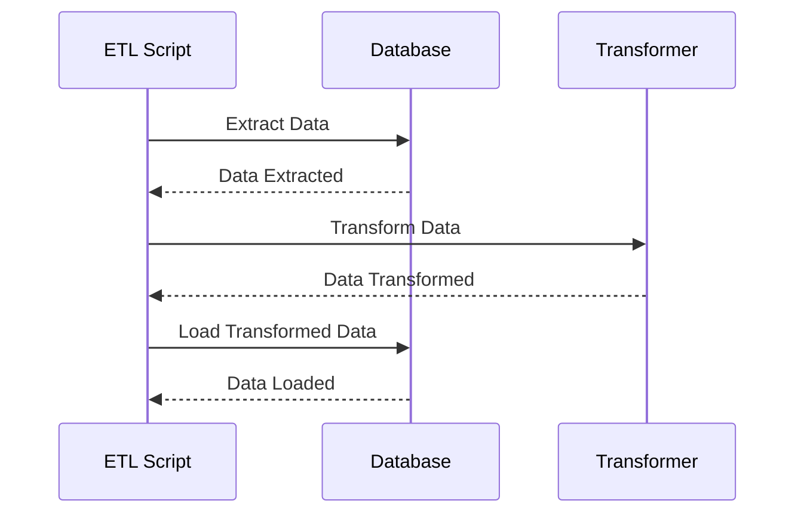

### Go-workers

Go-workers is a CLI library for processing jobs asynchronously.
You can create any kind of worker that you want, and it will be run as your command line parameters are defined.
Just add your scripts in the `cmd` folder and run `go-workers` to see the list of available workers.

It is inspired by own [plugn-run](https://github.com/falcucci/plugin-run), so basically it's a go version of it.

*This is a work in progress. It is not yet ready for use.*

Soon as possible I will add some examples about how to extract data from spreadsheet or migrate informations from a database to another using temporary tables and triggers.

### Installation
```bash
go get github.com/falcucci/go-workers
```

### Usage

As an example you can check it out the `cmd` folder. In this folder you can see how to use the scripts to extract data from a database, transform it and load it into another database.

```bash
go-workers <script>
```


### Environment Variables

The following environment variables can be used to configure the behavior of the application:

| Variable              | Description                                                                |
|-----------------------|----------------------------------------------------------------------------|
| `ApplicationName`     | The name of the application.                                               |
| `Env`                 | The environment in which the application is running (e.g. "production", "staging", "development"). |
| `DatabaseName`        | The name of the database to connect to.                                    |
| `UserName`            | The username to use when connecting to the database.                       |
| `Host`                | The hostname of the database server.                                       |
| `Password`            | The password to use when connecting to the database.                       |
| `Port`                | The port number to use when connecting to the database.                    |
| `SpreadSheetId`       | The ID of the Google Spreadsheet to use.                                   |
| `RefreshToken`        | The refresh token to use when authenticating with Google.                  |
| `Kind`                | The kind of resource to use (e.g. "calendar", "spreadsheet").             |
| `Team`                | The team that the application belongs to.                                  |
| `LogrusLogLevel`      | The log level to use with the Logrus logging library.                     |
| `BurzumLogLevel`      | The log level to use with the Burzum logging library.                     |
| `BurzumToken`         | The token to use with the Burzum logging library.                         |
| `Schedule`            | The schedule on which to run certain tasks (e.g. "0 0 * * *" for daily at midnight). |
| `ShowSql`             | A flag indicating whether or not to log SQL queries.                       |
| `MaxConcurrentProcs`  | The maximum number of concurrent processes to run.                         |


### ETL Scripts

This project contains a set of scripts that perform extract, transform, and load (ETL) tasks on data sources. These scripts are designed to facilitate the data pipeline process, allowing for the automated extraction and manipulation of data from various sources, and the loading of that data into a target database or data warehouse.

### Diagram of ETL Process Flow



### Extract

The extract phase of the ETL process involves retrieving data from various sources. This could include databases, APIs, or flat files such as CSV or JSON. The scripts in this project are designed to extract data from a variety of sources, using the appropriate methods and libraries for each source type.

### Transform

The transform phase involves manipulating the data in some way, such as cleaning, formatting, or aggregating it. The scripts in this project include various functions and methods for performing these transformations, allowing you to easily modify the data to meet the needs of your analysis or reporting.

### Load

The load phase involves writing the transformed data to a target destination, such as a database or data warehouse. The scripts in this project include functions and methods for loading the data into a variety of target systems, including popular databases like MySQL and PostgreSQL, as well as cloud-based data warehouses like Amazon Redshift and Google BigQuery.


## The Import Command Example

The `import` command allows you to import data from a spreadsheet into a database.

To use the `import` command, build it from the source code using the `go build` command. Once the binary is built, you can run it with the `import` flag.

For example:

```bash
./go-workers import
```

The `import` command will prompt you for the following information:

* The name of the spreadsheet to import from
* The number of rows updated from the spreadsheet


## Sheets credentials

Here are the instructions to generate a service account JSON file in the Google Cloud Console:

- Go to the Google Cloud Console.
- Click on the "Select a project" dropdown at the top of the page and select the project you want to create the service account for.
- In the left sidebar, navigate to the "IAM & Admin" section and click on the "Service accounts" link.
- Click the "Create Service Account" button.
- Enter a name and description for the service account, and click the "Create" button.
- On the next page, you can grant the service account permissions by assigning it roles. Click the "Continue" button when you're done.
- Click the "Create Key" button and choose the "JSON" key type. Click the "Create" button to download the JSON file.
- This JSON file contains the private key and other information needed to authenticate the service account. You can use it to authenticate and access Google APIs from your server or application.

